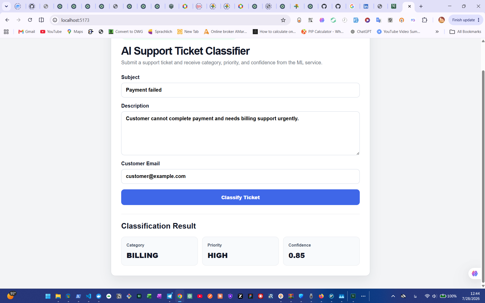
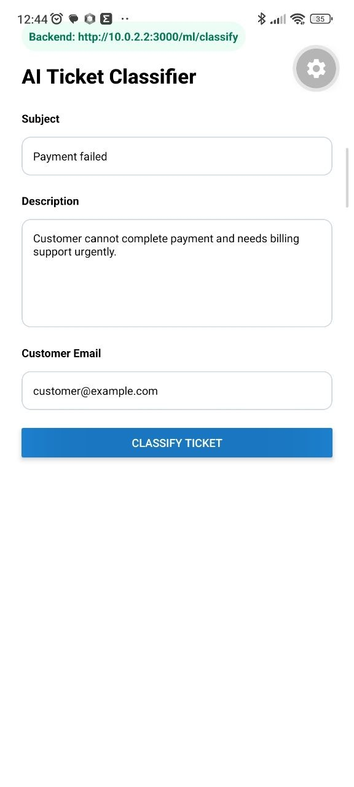
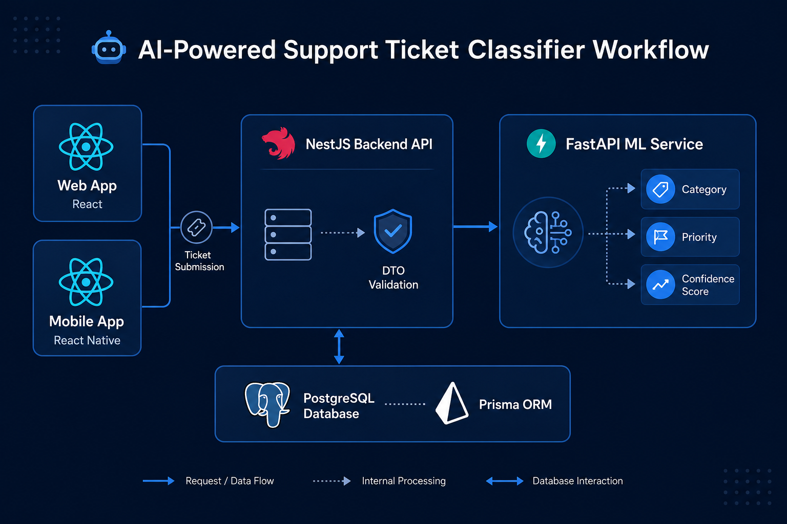

# AI-Powered Support Ticket Classifier

A production-style full-stack AI SaaS project for classifying customer support tickets using a modular backend, web frontend, mobile frontend, and machine learning service.

The system receives a customer support ticket, sends it to a backend API, forwards the ticket content to an ML service, and returns a predicted category, priority, and confidence score.

---

## Project Preview

### Web Application



### Mobile Application



### System Workflow



---

## What This Project Does

This project classifies customer support tickets automatically.

A user submits a ticket with:

- Subject
- Description
- Customer email

The system returns:

- Category
- Priority
- Confidence score

Example:
```json
{
  "category": "BILLING",
  "priority": "HIGH",
  "confidence": 0.85
}

This helps support teams route tickets faster, reduce manual triage, and improve response time.

---

## Main Features

- Full-stack AI-powered support ticket classification
- React web frontend
- React Native / Expo mobile frontend
- NestJS backend API
- FastAPI machine learning service integration
- TypeScript-based backend and frontend
- DTO validation on backend
- Form validation on frontend
- API client integration with Axios
- PostgreSQL and Prisma foundation
- Docker Compose setup
- GitHub-ready monorepo structure
- Suitable for SaaS and customer support automation use cases

---

## Tech Stack

### Backend

- Node.js
- NestJS
- TypeScript
- Prisma ORM
- DTO validation
- REST API architecture

### Database

- PostgreSQL
- Prisma schema and migration workflow

### Web Frontend

- React
- Vite
- TypeScript
- Axios
- React Hook Form
- Zod

### Mobile Frontend

- React Native
- Expo
- TypeScript
- Axios
- React Hook Form
- Zod

### Machine Learning Service

- FastAPI
- Python
- Classification service endpoint

### DevOps

- Docker
- Docker Compose
- Git
- GitHub

---

## Project Structure

text
AI-Powered Support Ticket Classifier
├── backend
│   ├── src
│   ├── prisma
│   ├── package.json
│   └── tsconfig.json
│
├── frontend-web
│   ├── src
│   ├── package.json
│   ├── vite.config.ts
│   └── tsconfig.json
│
├── mobile-app
│   ├── src
│   ├── App.tsx
│   ├── package.json
│   └── app.json
│
├── ml-service
│   ├── app
│   └── requirements.txt
│
├── docker-compose.yml
├── README.md
├── 1.png
├── 2.jpg
└── 3.png

---

## How The System Works

text
User
  ↓
Web App / Mobile App
  ↓
NestJS Backend API
  ↓
Request Validation
  ↓
FastAPI ML Service
  ↓
Prediction Result
  ↓
Backend Response
  ↓
Frontend Result Display

The frontend sends a ticket classification request to the backend.

The backend validates the incoming request and sends the ticket text to the ML service.

The ML service predicts:

- Ticket category
- Ticket priority
- Confidence score

Then the backend returns the result to the frontend clients.

---

## API Example

### Endpoint

http
POST /ml/classify

### Request Body

json
{
  "subject": "Payment failed",
  "description": "Customer cannot complete payment and needs billing support urgently.",
  "customerEmail": "customer@example.com"
}

### Response Body

json
{
  "category": "BILLING",
  "priority": "HIGH",
  "confidence": 0.85
}

---

## 15-Step Development Roadmap

### Step 1: Monorepo Bootstrap

The project was initialized as a full-stack monorepo.

Completed:

- Backend folder created
- Web frontend folder created
- Mobile app folder created
- ML service folder created
- Root project files added
- Git repository initialized

---

### Step 2: Backend Foundation

The backend foundation was created using NestJS and TypeScript.

Completed:

- NestJS project scaffolded
- Modular folder structure prepared
- Main application bootstrap configured
- TypeScript build workflow prepared
- Backend development server configured

---

### Step 3: Database Foundation

PostgreSQL and Prisma ORM were prepared for the project.

Completed:

- PostgreSQL configured through Docker Compose
- Prisma installed and integrated
- Prisma schema created
- Database connection environment prepared
- Migration workflow prepared

---

### Step 4: Ticket Domain Model

The ticket model and related enums were designed.

Completed:

- Ticket entity structure prepared
- Ticket category concept added
- Ticket priority concept added
- Ticket status concept prepared
- Database schema aligned with support ticket use case

---

### Step 5: DTO Validation

Backend validation was added to protect API input.

Completed:

- DTO classes created
- class-validator integrated
- ValidationPipe enabled
- Whitelist validation enabled
- Non-whitelisted fields blocked

---

### Step 6: Ticket API Foundation

The basic ticket REST API foundation was implemented.

Completed:

- Ticket controller created
- Ticket service created
- Create ticket workflow prepared
- List ticket workflow prepared
- Update ticket workflow prepared
- Delete ticket workflow prepared

---

### Step 7: Authentication Foundation

Authentication architecture was prepared for secured API access.

Completed:

- User ownership concept prepared
- JWT-based access flow planned
- Protected endpoint structure prepared
- Role-based access control planned

---

### Step 8: Secure Ticket API

Secure ticket API logic was added.

Completed:

- Protected ticket endpoints
- Tickets connected to authenticated users
- Regular users limited to their own tickets
- Admin and agent roles allowed to update tickets
- Ticket deletion limited to admin users
- Protected workflow tested through API requests

---

### Step 9: Machine Learning Service Foundation

The ML service was prepared as a separate service.

Completed:

- FastAPI service structure created
- Classification endpoint prepared
- Request and response structure defined
- ML service communication planned

---

### Step 10: Backend and ML Integration

The NestJS backend was connected to the ML service.

Completed:

- ML module created
- ML service class added
- Axios-based HTTP integration implemented
- Error handling improved
- Type-safe Axios error handling added
- Classification endpoint exposed through backend

---

### Step 11: Web Frontend Scaffold

The web frontend was created using React and Vite.

Completed:

- React Vite app scaffolded
- TypeScript configured
- Axios API client added
- Form page created
- CSS styling added
- Web app connected to backend URL

---

### Step 12: Web Form Validation

Frontend form validation was added.

Completed:

- React Hook Form integrated
- Zod schema added
- Subject validation added
- Description validation added
- Customer email validation added
- User-friendly validation messages added

---

### Step 13: Web Classification Result UI

The web app was connected to the backend classification endpoint.

Completed:

- Ticket form sends POST request to backend
- Loading state added
- Error state added
- Classification result displayed
- Category, priority, and confidence shown in UI

---

### Step 14: Mobile App Integration

The mobile app was prepared using Expo and React Native.

Completed:

- Expo TypeScript app configured
- Mobile ticket screen created
- Axios mobile API client added
- Android emulator backend URL configured
- Mobile form mirrors the web workflow
- Mobile app connected to backend classification endpoint

---

### Step 15: Final Integration and GitHub Preparation

The project was finalized for GitHub and portfolio presentation.

Completed:

- Backend, web frontend, mobile app, and ML service connected
- Web app tested successfully
- Mobile UI prepared and connected
- README documentation added
- Project screenshots added
- Workflow diagram added
- Repository prepared for commit and push

---

## Current Status

The core integration is complete.

Working now:

- Backend API
- ML classification endpoint
- Web frontend
- Mobile frontend
- API connectivity
- Classification result display

Verified output example:

text
Category: BILLING
Priority: HIGH
Confidence: 0.85

---

## Run The Project Locally

### 1. Start Backend

powershell
cd "backend"
npm install
npm run start:dev

Backend URL:

text
http://127.0.0.1:3000

---

### 2. Start Web Frontend

powershell
cd "frontend-web"
npm install
npm run dev

Web URL:

text
http://localhost:5173

---

### 3. Start Mobile App

powershell
cd "mobile-app"
npm install
npx expo start

For Android Emulator:

text
Press a

For Expo Web:

text
Press w

---

## Test Backend Classification Endpoint

powershell
$body = @{
  subject = "Payment failed"
  description = "Customer cannot complete payment and needs billing support urgently."
  customerEmail = "customer@example.com"
} | ConvertTo-Json

Invoke-RestMethod `
  -Uri "http://127.0.0.1:3000/ml/classify" `
  -Method Post `
  -ContentType "application/json" `
  -Body $body

Expected result:

text
category priority confidence
-------- -------- ----------
BILLING  HIGH     0.85

---

## Web API Configuration

The web frontend uses:

text
http://127.0.0.1:3000

Main endpoint:

text
POST /ml/classify

---

## Mobile API Configuration

For Android Emulator, the mobile app uses:

text
http://10.0.2.2:3000

For a real mobile device, replace it with your local network IP, for example:

text
http://192.168.1.5:3000

---

## Use Case

This project is useful for:

- SaaS support automation
- Customer service platforms
- Helpdesk systems
- Ticket triage automation
- AI-based customer support workflows
- Backend and ML integration portfolio projects

---

## Portfolio Value

This project demonstrates:

- Full-stack software engineering
- Backend API design
- Machine learning service integration
- Type-safe frontend development
- Mobile app integration
- Clean API communication
- DTO validation
- Monorepo project structure
- Practical SaaS architecture

---

## Future Improvements

Planned improvements:

- Save classified tickets in PostgreSQL
- Add ticket history page
- Add user authentication UI
- Add admin dashboard
- Add role-based dashboard views
- Add real ML model training pipeline
- Add Dockerfiles for each service
- Add CI/CD workflow
- Add production deployment
- Add automated tests

---

## Author

Developed by Alireza Naseri.

Focus areas:

- Backend Engineering
- Full-Stack Development
- TypeScript
- NestJS
- React
- React Native
- Machine Learning Integration
- SaaS Architecture

---

## License

This project is currently for educational, portfolio, and development purposes.